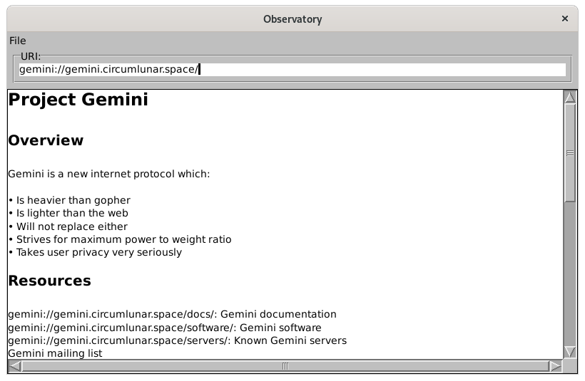

# Observatory

Observatory is a simple Gemini client written in Common Lisp using McCLIM. It currently supports loading and display of text/gemini documents through the Gemini protocol, including basic markup.

## Running

Observatory has been tested on SBCL and Clozure CL running on GNU/Linux.  I assume it will run on other Common Lisp implementations that support UTF-8 and can run McCLIM.  The dependency on McCLIM means that currently an X server is required.  In the past I have been able to run McCLIM applications under MS Windows by using VcXsrv (if I recall the correct X server), so it may be possible to run Observatory under MS Windows that way.

Place the files somewhere asdf can find them and evaluate `(asdf:load-system "observatory")`. If you have Quicklisp installed, you can have it handle that for you: Make an "observatory" subdirectory in Quicklisp's local-projects directory, place the files into it, and evaluate `(ql:quickload "observatory")`.

Once the system is loaded, you can run Observatory by evaluating `(observatory:observatory-main)`.

## Known Issues

Observatory is currently in early development, so it has a limited feature set, and it is easy to find a way to crash it.  On the other hand, it is quite usable for casual browsing of Gemini space.  One significant limitation is that it errors out with binary (and possibly other non-utf-8) files; this can probably be fixed by updating the stream format based on mime type after the server's response header is parsed.

When adding a bookmark, it may not save the name you give it unless you press ENTER before clicking the OK button.  I am not yet sure whether this is a bug in Observatory itself, or in McCLIM.

Observatory uses the McCLIM specific wrap* end-of-line-action on the main pane to provide word wrap functionality.  This means that it will probably not work on other CLIM implementations unless the text output routines are rewritten to handle word wrap themselves.  The Observatory package also uses McCLIM's :clim-extensions package.  Features from :clim-extensions were used while testing a more complicated bookmark system with folder support, but this was ultimately left out in favor of the current simple system.  However, :clim-extensions may be used in future releases if certain features that it would facilitate (such as tabbed browsing) are implemented.

## Wish List

Observatory doesn't need to do everything, but a few additional features could make it suitable for more "serious" use.  This is my TODO list, if I ever get around to it:

* Add the ability to display images (at least .png and .jpg)
* Add the ability to save a copy of the current document to disk
* Add the option to download non-text, non-gemtext files
* Settings options for users
* Get copy and paste working (yours truly is not a CLIM expert)
* Allow user to load other protocols (e.g. HTTP or Gopher) by starting the appropriate program
* Tabbed browsing
