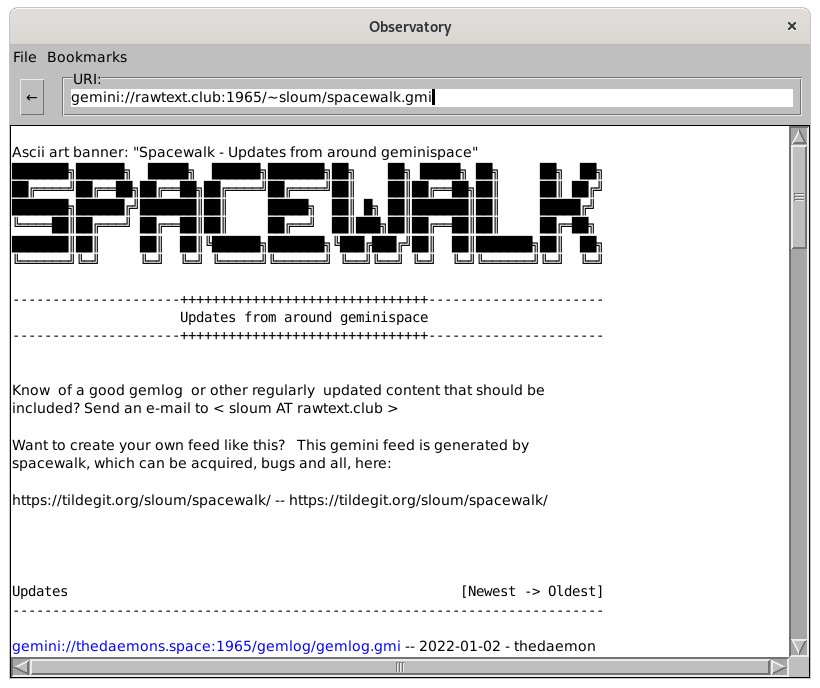

# Observatory

Observatory is a simple Gemini client written in Common Lisp using McCLIM. It currently supports loading and display of text/gemini documents through the Gemini protocol, including basic markup.

## Running

Place the files somewhere asdf can find them and evaluate `(asdf:load-system "observatory")`. If you have Quicklisp installed, you can have it handle that for you: Make an "observatory" subdirectory in Quicklisp's local-projects directory, place the files into it, and evaluate `(ql:quickload "observatory")`.

Once the system is loaded, you can run the ray tracer by evaluating `(rtiow:observatory)`.

## Known Issues

Observatory should be able to load and display most pages in gemtext, but is still lacking important features like support of INPUT status codes.